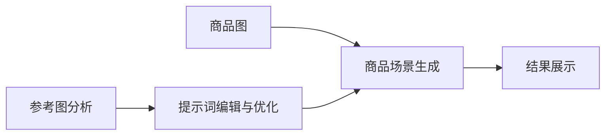
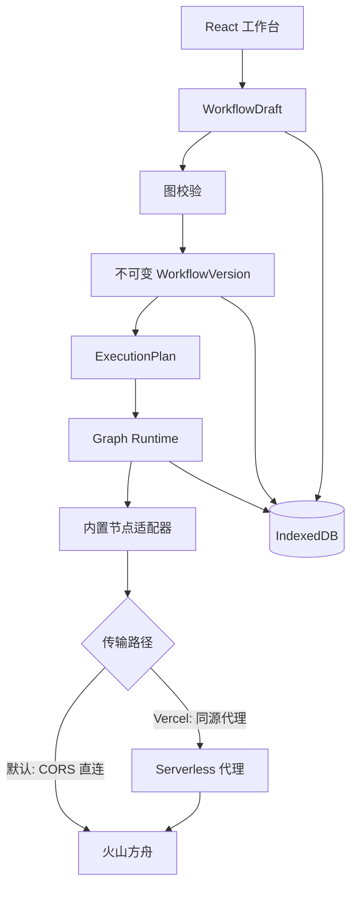

# Visual Director

> 本地优先、BYOK（自带密钥）的电商商品图 AI 工作流：从参考图分析、提示词编辑到商品场景生成，并将验证过的流程发布为可复用版本。

Visual Director 面向需要稳定生产电商静物图的个人创作者与小型团队。它把“看参考图、写提示词、上传商品图、生成、复核”整理成可视化工作流；用户既可以在节点中直接配置和试运行，也可以把节点连接成完整流程，发布后用于批量任务。

项目不提供免费模型额度。模型请求通过用户自己的火山方舟 API Key 与接入点完成，项目数据默认保存在浏览器本地。

## 核心流程



1. 新建项目，选择“直接生成”或“参考图辅助生成”模板。
2. 上传参考图与商品图，在节点中填写用途、提示词和生成参数。
3. 单独试运行节点，或运行整条工作流。
4. 校验草稿并发布为不可变版本。
5. 在批量任务中复用已发布版本，替换不同商品图进行生产。

## 功能特性

- **可视化工作流**：基于 React Flow 的节点编排，支持拖放、连线、缩放、自动布局、撤销与重做。
- **节点即工具**：核心节点可直接上传图片、编辑提示词、选择比例与分辨率，并单独试运行。
- **两种起步模板**：直接生成，以及包含参考图分析、商品图、提示词、生成和结果展示的辅助生成流程。
- **提示词工作台**：支持正向提示词、负面提示词、分析结果采用与 AI 优化建议。
- **工作流校验**：检查端口类型、必填输入、重复连接、环路、不可执行节点和输出路径。
- **不可变版本**：发布时固化工作流快照、执行计划与校验和；后续编辑不会修改历史版本。
- **真实执行计划**：可执行节点通过内置适配器调用现有分析、生成、验收和修复能力，不使用模拟运行结果。
- **批量复用**：批量任务绑定已发布版本，共享参考风格，并为每行商品提供独立输入与运行状态。
- **本地素材与记录**：项目、草稿、版本、运行记录和素材保存在 IndexedDB。
- **BYOK 安全模型**：API Key 仅保存在当前浏览器会话；模型默认经 CORS 直连火山方舟，托管部署可切换为同源代理。

## 当前实现状态

节点注册表目前包含 **35 个内置节点**：

- **17 个可执行节点**：覆盖参考图分析、商品图输入、提示词处理、图片生成、人工确认、结果验收、定向修复与结果输出。
- **18 个规划节点**：可在节点库中查看，但会明确标注“规划中”；缺少执行适配器的工作流不能发布或运行。

当前提供两个模板：

| 模板 | 用途 | 主要节点 |
| --- | --- | --- |
| 直接生成 | 已有明确创意方向，快速上传商品图并生成 | 商品场景生成 → 结果展示 |
| 参考图辅助生成 | 从目标参考图提取画面语言，再用于商品场景生成 | 参考图分析 + 商品图 → 提示词编辑 → 商品场景生成 → 结果展示 |

## 技术栈

| 类别 | 技术 |
| --- | --- |
| 前端 | React 18、TypeScript、Vite |
| 工作流画布 | `@xyflow/react` |
| UI | Radix UI、Tailwind CSS、Lucide Icons |
| 数据校验 | Zod |
| 本地存储 | IndexedDB、sessionStorage |
| 测试 | Vitest、Testing Library、jsdom |
| 托管部署 | Vercel Serverless（同源代理）|
| 自部署服务 | Node.js 原生 HTTP Server |

## 快速开始

### 环境要求

- Node.js 20 或更高版本
- npm 9 或更高版本
- 现代 Chromium 浏览器（推荐 Chrome 或 Edge）
- 火山方舟文本/视觉理解与图片生成 API Key、模型或接入点 ID

### 本地开发

```bash
npm install
npm run dev
```

打开 <http://localhost:5173>。首次使用时进入“模型设置”，填写自己的 API Key 和接入点。

> 未配置模型时仍可创建项目、编辑画布和保存草稿，但模型节点不能真实运行。

### 生产构建与自部署

```bash
npm run build
npm run serve
```

`npm run build` 会执行 TypeScript 检查并生成 `dist/`；`npm run serve` 使用零依赖 Node.js 服务托管静态文件，默认端口为 `5173`，可通过 `PORT` 环境变量修改。

```bash
PORT=8080 npm run serve
```

Windows PowerShell：

```powershell
$env:PORT = 8080
npm run serve
```

### 部署模型与同源代理

模型请求有两条传输路径，由构建期环境变量 `VITE_USE_SERVER_PROXY` 切换：

| 路径 | 触发方式 | 行为 |
| --- | --- | --- |
| **浏览器直连（默认）** | 普通 `npm run build` / `npm run dev` | 浏览器通过 CORS 直接请求火山 Platform API；火山按 Origin 反射放行 |
| **同源代理** | `VITE_USE_SERVER_PROXY=1 npm run build` | 模型请求改走同源端点 `/api/ark/chat`、`/api/ark/images` |

仓库内置 Vercel 配置：`vercel.json` 已在构建命令中注入开关，`api/ark/chat.ts`、`api/ark/images.ts` 是自包含的 Serverless 函数（独立实现，不依赖 `src/` 打包，规避平台对项目 TS 模块链的编译限制），推送到 Vercel 后自动生效。同源路径不依赖用户浏览器到火山接口的网络连通性，并在服务端做字段白名单与 SSRF 校验。

## 模型配置

模型设置保存在 `sessionStorage`，关闭标签页后清除。项目不会从 `.env` 读取或保存真实 API Key。

| 配置 | 是否必需 | 说明 |
| --- | --- | --- |
| 文本/视觉理解 API Key | 使用分析能力时必需 | 可与图片生成使用不同 Key |
| 文本/视觉理解 Endpoint | 使用分析能力时必需 | 只接受模型或接入点 ID，不接受 URL 或路径 |
| 图片生成 API Key | 使用出图能力时必需 | BYOK，不由项目提供额度 |
| 图片生成 Endpoint | 使用出图能力时必需 | 用于兼容 `/images/generations` 的模型调用 |
| 接口协议 | 可选 | 文本通道支持 OpenAI 兼容或 Anthropic 兼容协议 |
| Base URL | 可选 | 必须使用 HTTPS，且主机属于火山官方 `volces.com` 域名 |

可复制 [.env.example](.env.example) 配置自部署端口等非敏感选项；不要在 `.env`、源码、Issue、日志或截图中提交真实密钥。

## 使用指南

### 直接生成商品图

1. 在项目首页点击“新建项目”。
2. 填写项目名称并选择“直接生成”。
3. 在“商品场景生成”节点上传商品图。
4. 填写正向/负面提示词，选择用途、比例、数量和分辨率。
5. 运行节点或整条工作流，在“结果展示”节点查看输出。

### 使用参考图辅助生成

1. 选择“参考图辅助生成”模板。
2. 在“参考图分析”节点上传 1–5 张参考图并执行分析。
3. 在“商品图”节点上传需要保留主体身份的商品图片。
4. 在“提示词编辑与优化”节点采用或调整分析建议。
5. 在“商品场景生成”节点设置生成参数并运行。
6. 查看结果，确认草稿无阻断错误后发布版本。

### 批量复用工作流

1. 先在画布中发布一个可执行版本。
2. 打开项目的“批量任务”页面并选择该版本。
3. 按版本要求填写共享参考图和逐行商品图。
4. 启动批次并按行查看状态、结果与错误信息。

批量任务只接受已发布版本，避免画布编辑过程中改变正在运行的任务定义。

## 数据与安全

- **本地优先**：项目、草稿、工作流版本、运行记录、素材和批量数据存入浏览器 IndexedDB；不可用时退化为当前页面内存存储。
- **密钥不落盘**：API Key 只保存在 `sessionStorage`，不进入 IndexedDB、localStorage、Cookie、URL 或导出文件。
- **默认浏览器直连**：默认构建下浏览器经 CORS 直接请求火山接口，密钥只出现在发往火山官方域名的鉴权头中。
- **可选同源代理**：开启 `VITE_USE_SERVER_PROXY` 后浏览器只请求本项目同源端点，密钥经 `x-ark-api-key` 头传递；代理不记录 API Key、完整请求头或模型请求体。
- **SSRF 防护**：自定义 Base URL 必须为 HTTPS，并精确匹配火山官方域名边界（直连与代理路径均强制）。
- **请求白名单**：代理只转发允许的字段；外部图片 URL、任意工具调用和未授权内容会被过滤。
- **结构化校验**：模型输出经过 Zod Schema 校验，非法 JSON 或缺失字段会作为失败处理，不会伪装成功。
- **封闭节点体系**：用户不能注入代码、Shell、任意 HTTP、文件系统或第三方节点包。

## 项目结构

```text
visual-director/
├─ api/                     # Vercel Serverless 同源代理（chat / images，自包含）
├─ docs/                    # 产品、架构、数据、安全与验收文档
├─ scripts/                 # HTTP 冒烟检查脚本
├─ server/                  # 自部署静态服务器（零依赖 Node.js）
├─ src/
│  ├─ batch/                # 批量任务、预算、队列与执行策略
│  ├─ components/           # 画布、节点、批量、Shell 与通用 UI
│  ├─ data/                 # IndexedDB、项目、草稿、版本、运行和素材存储
│  ├─ hooks/                # 工作流、批量任务与模型设置状态
│  ├─ model/                # 火山客户端与传输层（直连 / 同源代理切换）
│  ├─ pages/                # 项目、画布、批量、素材、记录和设置页面
│  ├─ router/               # 零依赖 Hash Router
│  ├─ server/               # 同源代理处理器（Vercel / 自部署复用）
│  ├─ shared/               # 公共类型、Schema、常量与安全工具
│  └─ workflow/             # 图模型、校验、发布、执行计划与运行时
├─ .env.example
├─ package.json
├─ vercel.json
└─ vite.config.ts
```

## 架构概览



工作流只保存节点类型、配置和连接关系；网络请求能力由应用内置适配器提供。模型不能决定要访问的 URL、文件路径或节点类型。传输层（`src/model/transport.ts`）按构建环境在浏览器直连与同源代理之间切换。

## 常用命令

| 命令 | 作用 |
| --- | --- |
| `npm run dev` | 启动 Vite 开发环境（默认浏览器直连） |
| `npm run typecheck` | 执行 TypeScript 类型检查 |
| `npm run test` | 运行 Vitest 自动化测试 |
| `npm run test:watch` | 以监听模式运行测试 |
| `npm run build` | 类型检查并生成生产构建 |
| `npm run preview` | 预览静态构建产物 |
| `npm run serve` | 零依赖托管 `dist/`（自部署） |

构建并启动服务后，可运行 HTTP 冒烟检查：

```bash
node scripts/smoke-proxy.mjs http://localhost:5173
```

## 文档

完整设计与工程记录位于 [docs/](docs/)：

- [项目简报](docs/00-project-brief.md)
- [产品需求](docs/01-product-requirements.md)
- [用户流程](docs/02-user-flow.md)
- [数据结构](docs/03-data-schema.md)
- [模型契约](docs/04-model-contracts.md)
- [风险登记](docs/09-risk-register.md)
- [信息架构](docs/11-information-architecture.md)
- [画布工作台规范](docs/12-canvas-workspace-spec.md)
- [UI 设计系统](docs/13-ui-design-system.md)
- [UI 验收矩阵](docs/14-ui-acceptance-matrix.md)
- [自定义可执行工作流](docs/15-custom-workflow.md)

## 已知边界

- 仅支持内置节点，不支持用户代码、自定义插件和任意 HTTP 节点。
- 工作流使用 DAG；当前不支持通用循环、子工作流和任意并行汇聚。
- 规划中的节点可以编排和保存，但不能发布或运行。
- 项目没有账号系统、云同步、协作编辑、支付或内置模型额度。
- 默认浏览器直连依赖火山接口的 CORS 放行；若你的网络环境无法直连，请使用 Vercel 同源代理部署。
- 同源代理只允许访问火山官方域名，不是通用多模型代理。
- 图片和项目数据保存在当前浏览器；清除站点数据会移除本地项目。
- 生产使用前仍应使用自己的有效接入点验证模型质量、费用和吞吐量。

## 贡献

欢迎通过 Issue 反馈缺陷、交互问题和功能建议。提交 Pull Request 前建议：

1. 避免提交真实 API Key、用户图片或模型原始敏感响应。
2. 将改动限制在一个清晰主题内。
3. 为核心数据、校验或执行逻辑补充相应测试。
4. 在提交前运行与改动相关的检查。

```bash
npm run typecheck
npm run test
npm run build
```

推荐使用 Conventional Commits，例如：

```text
feat(canvas): add node-level test run
fix(proxy): reject non-volces hosts
docs: update deployment guide
```

## 许可证

当前仓库尚未包含 `LICENSE` 文件。在添加明确许可证之前，默认保留所有权利，不应视为已授权的开源软件。

## 致谢

- [火山方舟](https://www.volcengine.com/product/ark)与豆包 Seed 系列模型
- [React](https://react.dev/)
- [React Flow](https://reactflow.dev/)
- [Radix UI](https://www.radix-ui.com/)
- [Tailwind CSS](https://tailwindcss.com/)
- [Zod](https://zod.dev/)
- [Vite](https://vite.dev/)
- [Vitest](https://vitest.dev/)
